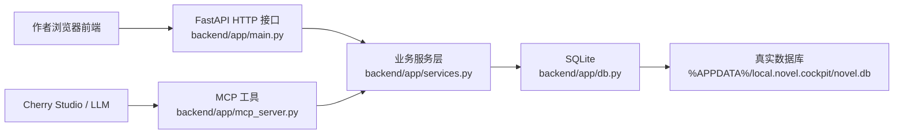
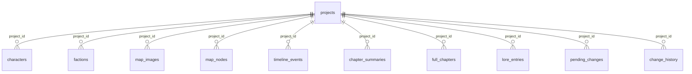

# 接口与代码关系审计

更新时间：2026-06-04

本文只记录当前代码结构和接口状态，不代表已经执行重构。目标是帮助后续开发时先看清现有关系，避免重复增加相似接口或把功能继续堆散。

## 一、总体结构

当前项目是浏览器优先的小说知识库，主要由四层组成：

核心原则已经基本形成：

- 前端手动编辑走 HTTP 直写接口。
- LLM 写入优先走 MCP `propose_*` 工具，进入 `pending_changes` 待审核。
- 审核通过后由 `approve_change` 把待审核 patch 写入正式表。
- `get_context_pack` 只读取已审核正式数据，不读取待审核草稿。

## 二、主要代码块职责

| 文件 | 当前职责 | 备注 |
| --- | --- | --- |
| `backend/app/db.py` | SQLite 表结构、字段迁移、唯一索引迁移、默认项目初始化 | 表之间没有数据库级外键，删除清理主要靠 service 层手动做。 |
| `backend/app/schemas.py` | FastAPI/Pydantic 入参模型、中文别名归一函数 | HTTP 和 MCP 间有部分归一逻辑重复存在于 `services.py`。 |
| `backend/app/services.py` | 项目、人物、势力、地图、境界、章节、时间线、待审核、历史、导入导出核心逻辑 | 当前最大文件，承担过多职责，是后续重构优先对象。 |
| `backend/app/main.py` | HTTP 路由层 | 大部分路由只是薄封装，但有直接写入和待审核两套入口并存。 |
| `backend/app/mcp_server.py` | MCP 工具层 | LLM 专用入口，已经从宽泛工具逐步转向专用 `propose_*` 工具。 |
| `frontend/src/main.jsx` | 当前 React 主应用和大部分页面组件 | 单文件过大，页面、工具函数、API 调用、组件状态混在一起。 |
| `frontend/src/styles.css` | 全局样式 | 页面样式集中，但地图、时间线、章节、书架等模块样式已经很长。 |

## 三、数据库与模块关系

重要表：

- `projects`：小说项目、当前激活状态、世界设定、境界体系总览。
- `characters`：人物基础字段和 `state_variables_json` 扩展变量。
- `factions`：势力结构。
- `map_images`：地图册卡片和图片数据。
- `map_nodes`：地图点位与多边形区域。
- `timeline_events`：故事内真实时间线。
- `chapter_summaries`：章节概览。
- `full_chapters`：完整正文。
- `pending_changes`：LLM 待审核草稿。
- `change_history`：写入历史和部分回滚依据。

目前数据库层有项目级唯一索引：

- `characters(project_id, name)`
- `factions(project_id, name)`
- `map_nodes(project_id, name)`
- `chapter_summaries(project_id, chapter)`
- `full_chapters(project_id, chapter)`

## 四、HTTP 接口现状

### 1. 前端当前正在使用的 HTTP 接口

从 `frontend/src/main.jsx` 搜索到的当前主路径：

| 模块 | 接口 | 用途 |
| --- | --- | --- |
| 总览 | `GET /api/dashboard` | 前端主数据入口，返回当前项目、项目列表、角色、世界、时间线、章节、待审核等。 |
| 势力 | `GET /api/factions` | 单独读取势力列表。 |
| 项目 | `POST /api/projects` | 新建小说。 |
| 项目 | `PATCH /api/projects/{project_id}` | 编辑小说书名、题材、简介。 |
| 项目 | `POST /api/projects/{project_id}/switch` | 切换当前小说。 |
| 项目 | `DELETE /api/projects/{project_id}` | 前端作者直接删除小说。 |
| 人物 | `PATCH /api/characters/{name}` | 前端作者直接修正人物。 |
| 势力 | `POST /api/factions` | 前端作者新建势力。 |
| 势力 | `PATCH /api/factions/{name}` | 前端作者编辑势力。 |
| 势力 | `DELETE /api/factions/{name}` | 前端作者删除势力。 |
| 境界 | `PATCH /api/world/power-system` | 前端作者直接保存境界体系。 |
| 地图节点 | `POST /api/world/map-nodes` | 前端作者新建地图节点/区域。 |
| 地图节点 | `PATCH /api/world/map-nodes/{node_id}` | 前端作者编辑地图节点/区域。 |
| 地图节点 | `DELETE /api/world/map-nodes/{node_id}` | 前端作者删除地图节点/区域。 |
| 地图图片 | `POST /api/world/map-image` | 新增地图图片/地图册。 |
| 地图图片 | `PATCH /api/world/map-images/{image_id}` | 更新或删除图片数据。 |
| 地图图片 | `DELETE /api/world/map-images/{image_id}` | 删除整张地图及其节点。 |
| 章节 | `POST /api/chapters/summary` | 前端作者保存章节概览。 |
| 章节 | `DELETE /api/chapters/summary/{chapter}` | 前端作者删除章节概览。 |
| 待审核 | `POST /api/pending-changes/{id}/approve` | 批准待审核。 |
| 待审核 | `POST /api/pending-changes/{id}/reject` | 拒绝待审核。 |

### 2. 当前前端未直接使用，但仍有价值的 HTTP 接口

这些接口可能面向外部脚本、旧 UI、调试或未来页面：

| 接口 | 状态判断 |
| --- | --- |
| `GET /api/projects` | 和 `GET /api/dashboard` 中的 `projects` 重叠；可保留为轻量项目列表接口。 |
| `POST /api/project/init` | HTTP 直接初始化会清空当前项目数据；与 MCP `init_project` 的“空壳项目 + 待审核”语义不同，需要特别标注风险。 |
| `GET /api/project/export` / `POST /api/project/import` | 当前主前端搜索不到直接调用，但仍是备份迁移能力。 |
| SillyTavern 导入导出接口 | 当前主页面未直接调用，属于兼容能力。 |
| `POST /api/context-pack` | 前端不用，适合调试或非 MCP 客户端读取上下文包。 |
| `GET /api/characters/{name}` / `GET /api/factions/{name}` | 前端目前主要靠 dashboard/list 数据，单项查询可保留给脚本和调试。 |
| `GET/PATCH /api/world/profile` | 世界设定页当前未成为主页面；后续若恢复世界设定页可用。 |
| `GET /api/world` | 与 dashboard 中 `world` 重叠；可保留为轻量世界查询。 |
| `GET /api/timeline` | 前端目前可从 dashboard 获取时间线，单独接口可保留。 |
| `GET /api/chapters/summaries` | 与 dashboard 重叠；可保留给外部工具。 |
| `GET/POST /api/chapters/full` | 当前主 UI 未稳定展示完整正文编辑页时属于预留能力。 |
| `GET /api/history` / `POST /api/history/{id}/rollback` | 当前前端主路径搜索不到，历史页能力需要确认是否仍保留。 |
| `GET /api/schema` / `POST /api/schema/{kind}/validate` | 对调试 LLM payload 很有价值，但前端目前没有独立使用页面。 |

## 五、MCP 工具现状

MCP 已经形成三类工具：

### 1. 读取类

- `healthcheck`
- `list_projects`
- `get_context_pack`
- `get_character`
- `get_factions`
- `get_faction`
- `get_world_state`
- `get_world_profile`
- `get_power_system`
- `get_timeline`
- `list_full_chapters`
- `get_full_chapter`
- `get_pending_changes`

### 2. 结构说明与校验类

- `get_payload_templates`
- `get_schema`
- `validate_payload`

注意：`get_payload_templates` 和 `get_schema` 职责接近，但数据来源不同。前者是旧模板，后者是新中文 schema。后续建议统一成一个主入口，避免 LLM 不知道该先看哪个。

### 3. 写入提案类

- 项目：`create_project`、`switch_project`、`propose_delete_project`
- 初始化：`init_project`
- 人物：`propose_character_create`、`propose_character_update`、`propose_delete_character`
- 势力：`propose_faction_create`、`propose_faction_update`、`propose_delete_faction`
- 世界设定：`propose_world_summary_update`、`propose_world_profile_update`、`propose_world_update`
- 境界：`propose_power_system_update`、`propose_power_realm_create`、`propose_power_realm_update`、`propose_power_realm_delete`
- 地图：`propose_map_create`、`propose_map_update`、`propose_map_delete`、`propose_map_node_update`、`propose_map_region_update`、`propose_map_node_delete`
- 时间线：`propose_timeline_event_create`、`propose_timeline_event_delete`
- 章节：`add_chapter_summary`、`propose_chapter_overview_update`
- 正文：`save_full_chapter`

## 六、发现的重复或语义重叠

### 1. `get_payload_templates` 与 `get_schema`

重复点：

- 都在告诉 LLM “应该怎么填 JSON”。
- README 还在强调 `get_payload_templates`，但新 MCP 设计明显更推荐 `get_schema` 和 `validate_payload`。

建议：

- 保留 `get_payload_templates` 作为兼容旧提示词入口。
- 新文档和提示词统一推荐 `get_schema(kind)`。
- 后续可让 `get_payload_templates` 内部直接返回 `get_schema` 的示例，减少两套模板漂移。

### 2. HTTP 直写接口与 MCP 待审核接口并存

例如：

- HTTP `PATCH /api/characters/{name}` 直接写库。
- MCP `propose_character_update` 进入待审核。

这是合理的双通道设计，但需要明确边界：

- 作者浏览器操作：可以直写。
- LLM 操作：默认待审核。

风险：

- 如果未来给外部开放 HTTP，外部脚本也可以绕过待审核直接写库。

建议：

- README 和接口审计中持续强调 HTTP 是作者可信通道，MCP 是 LLM 受控通道。
- 部署到 VPS 前必须加认证，否则直接删除、编辑接口风险很高。

### 3. 地图图片删除接口重复

当前存在：

- `DELETE /api/world/map-image`
- `DELETE /api/world/map-images/{image_id}`
- `PATCH /api/world/map-images/{image_id}` 且可通过空 `image_data` 删除图片本体。

语义区别：

- `DELETE /api/world/map-images/{image_id}`：删除整张地图及节点。
- `PATCH /api/world/map-images/{image_id}` 且 `image_data` 为空：只删除图片数据，保留地图信息和节点。
- `DELETE /api/world/map-image`：旧式无参删除，容易造成歧义。

建议：

- 标记 `DELETE /api/world/map-image` 为旧接口。
- 文档中明确“删除图片”和“删除地图”是两个不同动作。
- 后续可新增更清晰的 `DELETE /api/world/map-images/{image_id}/image-data`，再逐步废弃无参旧接口。

### 4. 世界更新入口过宽

当前同时存在：

- `propose_world_update`
- `propose_world_summary_update`
- `propose_world_profile_update`
- `propose_power_system_update`
- 地图、势力、境界等专用 propose 工具

问题：

- `propose_world_update` 太宽，LLM 可能把地图、势力、世界书、规则混在一起提交。
- 宽泛入口会降低待审核预览的准确性。

建议：

- 新提示词只推荐专用工具。
- `propose_world_update` 仅作为兼容旧提示词的兜底入口。

### 5. `init_project` HTTP 与 MCP 语义不同

HTTP `POST /api/project/init`：

- 直接清空当前项目下角色、地图、时间线、章节、势力、待审核、历史等数据。
- 直接落库。

MCP `init_project`：

- 创建/切换空壳项目。
- 具体资料进入待审核。

风险：

- 两个同名功能语义差距很大，容易误用。

建议：

- 将 HTTP `init_project` 标记为“危险维护接口”。
- 前端和 LLM 不应默认使用 HTTP 初始化接口。
- 后续可改名为 `reset_project_with_payload` 或增加显式确认字段。

## 七、发现的缺失接口

### 1. MCP 缺少项目编辑工具

已有：

- HTTP `PATCH /api/projects/{project_id}`
- MCP `create_project`
- MCP `switch_project`
- MCP `propose_delete_project`

缺少：

- `propose_project_update` 或 `update_project_metadata`

影响：

- LLM 不能通过受控 MCP 修改书名、题材、简介。

建议：

- 如果允许 LLM 改项目元信息，应走待审核：`propose_project_update(project_title?, project_id?, patch, reason)`。

### 2. MCP 缺少章节概览删除工具

已有 service：

- `propose_chapter_overview_delete`

已有 HTTP：

- `DELETE /api/chapters/summary/{chapter}`

缺少 MCP：

- `propose_chapter_overview_delete`

影响：

- LLM 无法提交“删除/废弃某章概览”的待审核请求，只能更新。

### 3. MCP 缺少故事时间线事件修改工具

已有：

- `propose_timeline_event_create`
- `propose_timeline_event_delete`

缺少：

- `propose_timeline_event_update`

影响：

- LLM 如果写错时间线事件，只能新增一条或请求删除，不能明确修改已有事件。

### 4. HTTP 缺少故事时间线手动写入接口

当前 HTTP 只有：

- `GET /api/timeline`

没有：

- `POST /api/timeline/events`
- `PATCH /api/timeline/events/{id}`
- `DELETE /api/timeline/events/{id}`

影响：

- 如果正式时间线页要支持作者手动添加/编辑/删除，需要补 HTTP 直写接口。

### 5. HTTP 缺少专用待审核创建接口

HTTP 侧只有少量 propose：

- 项目删除提案
- 角色删除提案
- 势力删除提案
- 世界宽泛提案
- 角色/势力旧式 propose

而 MCP 有更完整的专用 propose 工具。

影响：

- 如果前端未来也想模拟 LLM 待审核写入，或做“导入先预览后批准”，HTTP 缺少同等接口。

建议：

- 前端导入类功能优先走同一套 `propose_*` service，而不是直写正式表。

## 八、无用或疑似过时接口

以下不是立刻删除建议，只是需要复核：

| 接口/函数 | 疑点 |
| --- | --- |
| `DELETE /api/world/map-image` | 无参地图图片删除语义不清，已有按 ID 删除接口。 |
| `GET /api/projects` | 当前前端主要用 dashboard 拿项目列表，可保留给外部脚本。 |
| `GET /api/chapters/summaries` | 与 dashboard 重叠，可保留轻量查询。 |
| `GET /api/world` | 与 dashboard 中 world 重叠，可保留给外部工具。 |
| `get_payload_templates` | 与 `get_schema` 重叠，建议作为兼容层。 |
| `POST /api/project/init` | 功能危险且和 MCP `init_project` 语义不同，不应作为普通入口。 |

## 九、安全与一致性风险

### 1. 没有认证

当前 FastAPI 没有登录、Token、权限校验。

本地使用问题不大，但部署到 VPS 或反代域名后，风险很高：

- 任意访问者可删除小说。
- 任意访问者可改人物、势力、地图、章节。
- 任意访问者可导出项目数据。

建议：

- VPS 部署前至少加一个反代 Basic Auth 或应用级 Token。
- HTTP 删除/导出接口尤其需要保护。

### 2. 全局“当前激活项目”不适合多人并发

当前很多 HTTP/MCP 操作默认依赖 `projects.is_active = 1`。

风险：

- 多个浏览器或多个 LLM 同时操作时，一个客户端切书会影响另一个客户端。
- VPS 多用户场景会串项目。

建议：

- 单用户本地继续可用。
- VPS 版应把 `project_id` 放进 URL 或请求体，前端路由也显式携带项目 ID。
- MCP 工具应强制推荐带 `project_title` 或 `project_id`。

### 3. 破坏性 HTTP 接口可直接执行

例如：

- `DELETE /api/projects/{project_id}`
- `DELETE /api/factions/{name}`
- `DELETE /api/characters/{name}`
- `DELETE /api/world/map-images/{image_id}`
- `DELETE /api/world/map-nodes/{node_id}`

这些接口适合“作者可信前端”，但不适合裸露到公网。

建议：

- 前端保留二次确认。
- 后端后续可要求确认字段，例如 `{confirm: true}`。
- 公网必须加认证。

### 4. 图片数据直接存 SQLite

`map_images.image_data` 存 base64 图片。

风险：

- 大图会让 SQLite 文件膨胀。
- HTTP 请求体没有大小限制。
- 备份导出会变重。

建议：

- 短期限制图片大小。
- 中期把图片落到文件系统或对象存储，数据库只存路径和元数据。

### 5. 没有数据库级外键

项目删除、地图删除等清理依赖 service 手动删除。

风险：

- 如果绕过 service 操作数据库，可能产生孤儿数据。
- 部分未来新增表容易漏清。

建议：

- 继续保持 service 删除时集中清理。
- 后续重构可逐步加外键和 `ON DELETE CASCADE`，但要小心旧库迁移。

## 十、建议的整理顺序

### 第一优先级：接口语义收敛

1. README 中把 MCP 工具列表更新为当前完整工具，而不是第一版旧列表。
2. 明确 `get_schema` 是新主入口，`get_payload_templates` 是兼容入口。
3. 给危险接口 `POST /api/project/init` 加文档警告。
4. 明确地图“删除图片”和“删除整张地图”两种语义。

### 第二优先级：补齐缺失能力

1. 增加 MCP `propose_project_update`。
2. 增加 MCP `propose_chapter_overview_delete`。
3. 增加 MCP `propose_timeline_event_update`。
4. 如果时间线页要手动编辑，增加 HTTP 时间线事件 CRUD。

### 第三优先级：服务层拆分

`backend/app/services.py` 建议逐步拆成：

- `project_service.py`
- `character_service.py`
- `faction_service.py`
- `world_service.py`
- `map_service.py`
- `timeline_service.py`
- `chapter_service.py`
- `pending_service.py`
- `import_export_service.py`
- `schema_service.py`

拆分前提：

- 先补测试。
- 保留 `services.py` 作为兼容导出层一段时间。
- 一次只拆一个模块，避免大爆炸式重构。

### 第四优先级：前端拆分

`frontend/src/main.jsx` 建议逐步拆成：

- `api/client.js`
- `components/BookshelfWorkspace.jsx`
- `components/CharacterWorkspace.jsx`
- `components/FactionWorkspace.jsx`
- `components/MapWorkspace.jsx`
- `components/TimelineWorkspace.jsx`
- `components/ChapterOverviewWorkspace.jsx`
- `components/PendingPreviewPanel.jsx`
- `utils/normalizers.js`
- `utils/map.js`

拆分原则：

- 不改变行为。
- 先移动纯函数，再移动组件。
- 每次拆分后跑 `npm test -- --run` 和 `npm run build`。

## 十一、后续新增功能前检查清单

新增或修改接口前，先回答：

1. 这是作者前端直写，还是 LLM 待审核？
2. 是否已有 HTTP 或 MCP 同类接口？
3. 是否应该复用 `validate_payload`？
4. 是否需要进入 `pending_changes`？
5. 审核通过后 `approve_change` 是否已支持该 `target_type`？
6. 是否要写入 `change_history`？
7. 是否会影响导入/导出？
8. 是否依赖当前激活项目，还是应显式传 `project_id`？

这个清单可以作为之后避免“加加加”的第一道闸门。
